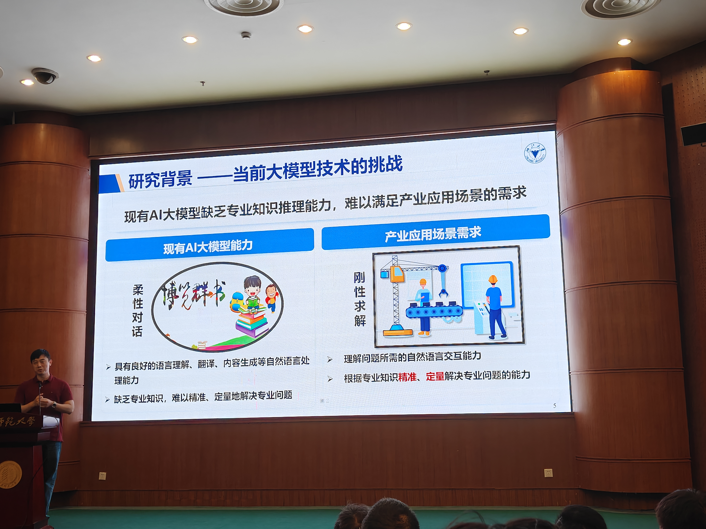
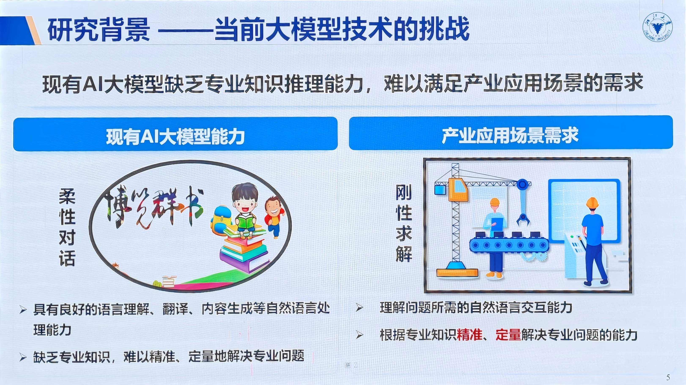

# PPT-auto-Corrector

✨ 自动将拍摄的 PPT 照片矫正为标准幻灯片图像！  
使用 [Segment Anything Model (SAM)](https://github.com/facebookresearch/segment-anything) 智能识别 PPT 区域，进行透视变换、去畸变、尺寸标准化（如 1920×1080），并支持按文件大小或名称排序输出。

📸 拍摄的讲座/会议 PPT → 🖼️ 标准化幻灯片图像，适用于归档、教学、笔记整理。

🖼️ 效果对比：矫正前后

<table>
  <tr>
    <td></td>
    <td></td>
  </tr>
  <tr>
    <td align="center"><b>矫正前</b></td>
    <td align="center"><b>矫正后</b></td>
  </tr>
</table>

*(示意图：左为原始照片，右为矫正后效果)*

---

## 🔧 功能亮点

- ✅ **自动检测 PPT 区域**：使用 SAM 模型精准分割黑板/投影中的 PPT 内容。
- ✅ **透视矫正**：自动提取四边形轮廓，进行透视变换，消除拍摄角度畸变。
- ✅ **输出标准化**：支持自定义输出尺寸（默认 1920×1080）。
- ✅ **批量处理**：支持文件夹内多图批量处理。
- ✅ **智能排序**：支持按文件大小或文件名自然排序（适合时间序列命名）。
- ✅ **鲁棒性强**：对模糊、倾斜、阴影等常见问题有较好适应性。

---

## 🚀 快速开始

### 1. 克隆项目

```bash
git clone https://github.com/your-username/ppt-auto-corrector.git
cd ppt-auto-corrector
```

### 2. 安装依赖

```bash
pip install opencv-python numpy torch torchvision torchaudio
pip install segment_anything
pip install natsort  # 用于自然排序
```

> ⚠️ 注意：SAM 模型需要 PyTorch 支持 CUDA（推荐）或 CPU。

### 3. 下载 SAM 模型权重

前往 [Segment Anything Model 官方发布页](https://github.com/facebookresearch/segment-anything#model-checkpoints) 下载模型：

```bash
wget https://dl.fbaipublicfiles.com/segment_anything/sam_vit_h_4b8939.pth
```

并将文件放入项目根目录，或修改 `SAM_CHECKPOINT` 路径。

### 4. 准备输入图片

将拍摄的 PPT 图片（`.jpg`）放入 `input_dir` 文件夹（或修改 `INPUT_DIR`）。

示例命名：
```
IMG20250926093230.jpg
IMG20250926093315.jpg
...
```

### 5. 运行脚本

```bash
python ppt_auto_corrector.py
```

输出将保存在 `corrected_ppt/` 文件夹中，文件名为 `corrected_*.jpg`。

```bash
python image_to_pdf.py
```

将保存在 `corrected_ppt/` 文件夹中的图像输出为PDF `ppt_slides.pdf`。

---

## ⚙️ 配置说明

修改脚本顶部的配置参数以适应你的需求：

```python
INPUT_DIR = "input_dir"           # 输入图片文件夹
OUTPUT_DIR = "corrected_ppt"     # 输出文件夹

SAM_CHECKPOINT = "sam_vit_h_4b8939.pth"
MODEL_TYPE = "vit_h"             # 支持 'vit_h', 'vit_l', 'vit_b'
DEVICE = "cuda" if torch.cuda.is_available() else "cpu"

TARGET_WIDTH = 1920              # 输出宽度
TARGET_HEIGHT = 1080             # 输出高度（默认 16:9）

SORT_BY = "size_desc"            # 排序方式: 'size_asc', 'size_desc', 'name'
```

---

## 📂 输出示例

```
corrected_ppt/
├── corrected_IMG20250926093230.jpg
├── corrected_IMG20250926093315.jpg
└── ...
```

每张图均为矫正后的标准幻灯片图像，可直接用于播放或转视频。

---

## 📷 适用场景

- 教学讲座拍照 → 整理为电子课件
- 会议白板/投影记录 → 存档
- 学术报告记录 → 快速生成幻灯片素材
- 手机拍摄 PPT → 转为高清图像

---

## 📦 依赖

- Python >= 3.8
- PyTorch
- OpenCV
- NumPy
- segment-anything (Facebook AI)
- natsort (可选，推荐)

---


## 🙌 致谢

- [Segment Anything Model (SAM)](https://github.com/facebookresearch/segment-anything) by Facebook AI
- OpenCV 团队


